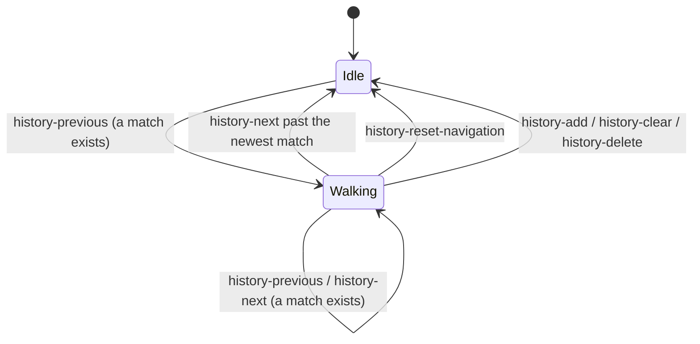

# Recall Navigation

This is the cursor an ++arrow-up++ / ++arrow-down++ key pair drives.

```lisp
(history-kit:history-previous history current-input)
(history-kit:history-next history)
(history-kit:history-navigating-p history)
(history-kit:history-reset-navigation history)
```

## Walking backward

`history-previous` steps one match further back and returns its text, or `nil`
when there is no older match — in which case the cursor stays where it was, so
holding ++arrow-up++ at the oldest entry does nothing rather than resetting.

```lisp
(defparameter *history*
  (let ((history (history-kit:make-history)))
    (dolist (text '("git status" "ls -la" "git commit") history)
      (history-kit:history-add history text))))
;; newest first: ("git commit" "ls -la" "git status")

(history-kit:history-previous *history* "")   ; => "git commit"
(history-kit:history-previous *history* "")   ; => "ls -la"
(history-kit:history-previous *history* "")   ; => "git status"
(history-kit:history-previous *history* "")   ; => NIL
```

On an empty store it returns `nil` and starts no walk at all.

## The frozen filter

`current-input` matters only on the **first** call of a walk. There it becomes
the filter applied to every subsequent step:

```lisp
(history-kit:history-previous *history* "git ")  ; => "git commit"
(history-kit:history-previous *history* "git ")  ; => "git status"
;;                                                  "ls -la" skipped
```

Later calls ignore the argument entirely, so the caller may pass whatever the
buffer currently shows without disturbing the walk:

```lisp
(history-kit:history-reset-navigation *history*)

(history-kit:history-previous *history* "git ")       ; => "git commit"
;; The buffer now reads "git commit", but the filter is still "git ".
(history-kit:history-previous *history* "git commit") ; => "git status"
```

This is the detail hand-rolled implementations most often lose. A cursor that
re-derived its filter from the current buffer would, on the second press, start
matching against `git commit` and jump to a different set of entries — or, more
commonly, to none at all.

### Matching rules

The filter is matched **line-prefix** under **smartcase**:

- line-prefix, so a multi-line entry is recalled by any of its lines;
- smartcase, so a lower-case filter matches loosely and one with an upper-case
  character matches exactly.

```lisp
(defparameter *mixed*
  (let ((history (history-kit:make-history)))
    (dolist (text '("git push" "Git log") history)
      (history-kit:history-add history text))))

(history-kit:history-previous *mixed* "Git")   ; => "Git log"
(history-kit:history-previous *mixed* "Git")   ; => NIL
```

An empty filter matches everything, which is why passing `""` walks the whole
history.

## Walking forward

`history-next` steps one match back toward the newest end. Stepping past the
newest match ends the walk and returns the input preserved when it began:

```lisp
(history-kit:history-reset-navigation *history*)

(history-kit:history-previous *history* "git ")  ; => "git commit"
(history-kit:history-previous *history* "git ")  ; => "git status"
(history-kit:history-next *history*)             ; => "git commit"
(history-kit:history-next *history*)             ; => "git "  -- the origin
(history-kit:history-navigating-p *history*)     ; => NIL
```

That last step is the second detail worth having: the half-written `git ` is
still there, so an accidental ++arrow-up++ costs nothing to undo. Handing back
an empty buffer instead — the usual shortcut — silently destroys work.

`history-next` returns `nil` when no walk is in progress.

## Ending a walk

```lisp
(history-kit:history-reset-navigation history)   ; => the history
```

Call this when the recalled line has been accepted or the input abandoned, so
the next ++arrow-up++ starts a fresh walk from the newest entry.

Navigation also resets **automatically** whenever entry positions shift, since a
surviving cursor would point at a different entry than the user last saw:

| Operation | Resets navigation |
| --- | --- |
| `history-add` | Always |
| `history-clear` | Always |
| `history-delete` | Only when it removed something |
| `history-merge` | Always (it records entries) |

```lisp
(history-kit:history-previous *history* "")
(history-kit:history-add *history* "pwd")
(history-kit:history-navigating-p *history*)   ; => NIL
(history-kit:history-previous *history* "")    ; => "pwd"
```

## Wiring it to keys

```lisp
(defun handle-key (history key buffer)
  "Return the new input buffer after KEY."
  (case key
    (:up   (or (history-kit:history-previous history buffer) buffer))
    (:down (or (history-kit:history-next history) buffer))
    (:enter
     (history-kit:history-add history buffer)   ; resets navigation itself
     "")
    ;; Any ordinary edit abandons the walk, so the next Up re-reads the buffer
    ;; as a fresh filter.
    (t
     (history-kit:history-reset-navigation history)
     buffer)))
```

Both `history-previous` and `history-next` return `nil` to mean "nothing
happened", which is why each is wrapped in `or ... buffer` — the buffer is left
exactly as it was.

## State summary

A store is in one of two states:



`history-navigating-p` reports which one. While idle, the cursor holds no
filter and no origin; the next `history-previous` establishes both.
